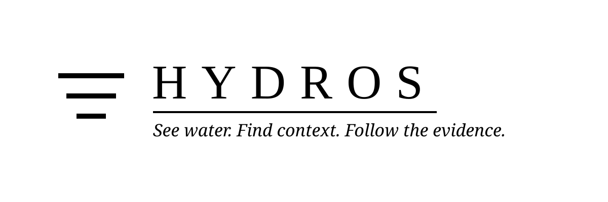

<p align="center">
  
</p>

<p align="center">
  <strong>See water. Find context. Follow the evidence.</strong>
  <br>
  An evidence-first investigation tool for urban freshwater ecosystems, built on the One Health model.
</p>

<p align="center">
  <code>Track 2 · Data-to-Insight</code>
  <code>Track 3 · AI-Supported Assessment</code>
  <code>Track 6 · Resilience Informatics</code>
  <code>Track 7 · Digital Health Standards</code>
</p>

## What Hydros is

Hydros turns a photograph of an urban waterway (or a guided visual checklist)
plus its location into a structured water investigation. It brings visual
observations, geographic context, public web sources, One Health exposure
pathways, and a cautious assessment into one workflow — built for the IEEE
OneAquaHealth Global Hackathon 2026.

```text
Photo + Location
       ↓
Visual Analysis
       ↓
Geographic Context
       ↓
Confirm observations (you check the AI's work)
       ↓
Research Plan → Web Search → Evidence Synthesis
       ↓
One Health pathways
       ↓
Assessment
```

The result is not a black-box verdict. Hydros keeps the path from what was
seen to what was found to what can reasonably be inferred visible throughout.

## Observation → Evidence → Inference

Hydros deliberately keeps three kinds of information separate, enforced in the
type system (`types/investigation.ts`), not just in copy:

| Layer | What it means | Example |
| --- | --- | --- |
| **Observation** | What can actually be seen in the photograph. | “The water appears brown and cloudy.” |
| **Evidence** | What a retrieved external source states, with its URL preserved. | “A public report documented elevated turbidity in the surrounding basin.” |
| **Inference** | What can reasonably be concluded from the observations and evidence together. | “The findings raise concern, but do not establish contamination at this exact location.” |

An observation is not automatically a contamination claim. Between evidence
and inference sits a bridge layer — `HealthPathway` (`lib/ai/one-health.ts`) —
that links observations to *potential* exposure pathways, always conditional,
always cited. Only `RiskAssessment` may conclude, and `INSUFFICIENT_DATA` is a
first-class outcome.

## One Health framing

Ecosystem health, animal health, and human health are one linked chain, and
urban water runs through all three. Hydros maps each investigation's evidence
onto exposure pathways grouped by domain:

- **Ecosystem** — habitat degradation, algal pressure, flow alteration.
- **Animal** — wildlife exposure via drinking, bathing, or food chain.
- **Human** — ingestion, dermal, recreational, irrigation, or livestock-watering
  contact, stated conditionally and only with a cited basis.

Every pathway carries its `basis` (source URLs or observation attributes),
a `strength`, and a `confirmationRequired` field naming what would need to be
measured to confirm it. Pathways never assert harm — they state that a route
exists.

## Track alignment

| Track | What Hydros delivers | Where |
| --- | --- | --- |
| 2 · Data-to-Insight | Photo/location → visual analysis → OSM context → web research → assessment | `lib/investigation/orchestrator.ts`, `lib/ai/*`, `lib/geo/*` |
| 2 · Data-to-Insight | Site grouping (geohash ~150 m), risk timelines, observation drift | `lib/geo/site.ts`, `lib/investigation/trends.ts`, `app/site/[geohash]/page.tsx` |
| 3 · AI-Supported Assessment | Human-in-the-loop observation confirmation with visible provenance | `components/investigation/ObservationConfirmation.tsx`, `app/api/investigate/[id]/confirm/route.ts` |
| 3 · AI-Supported Assessment | Guided stream-assessment entry producing structured observations | `app/investigate/guided/page.tsx`, `lib/investigation/guided.ts` |
| 3 · AI-Supported Assessment | One Health exposure pathways in conditional, cited language | `lib/ai/one-health.ts`, `components/investigation/HealthPathways.tsx` |
| 6 · Resilience Informatics | Real greyscale investigation map with clustering and risk filters | `components/map/WaterMap.tsx`, `app/map/page.tsx` |
| 6 · Resilience Informatics | Deterministic, auditable degradation alerts (threshold rules, not prediction) | `lib/investigation/alerts.ts`, `app/alerts/page.tsx` |
| 6 · Resilience Informatics | Five OneAquaHealth research-city hubs with seeded demos | `lib/geo/cities.ts`, `app/cities`, `scripts/seed-demo.mjs` |
| 7 · Digital Health Standards | FHIR R4 bundle export incl. Provenance | `lib/fhir/*`, `app/api/investigate/[id]/fhir/route.ts` |
| 7 · Digital Health Standards | JSON-LD / DCAT FAIR endpoints | `app/api/investigate/[id]/jsonld/route.ts`, `app/api/investigations.jsonld/route.ts` |

Local codes live under `http://hydros.local/CodeSystem/` (see
`lib/fhir/code-system.ts`). Where no standard code genuinely applies, Hydros
uses text and says so — it does not invent LOINC codes.

FAIR, concretely: **Findable** via stable investigation IDs and the
`/api/investigations.jsonld` DataCatalog; **Accessible** over HTTPS GET with
no auth for public investigations; **Interoperable** through FHIR R4
(`application/fhir+json`) and schema.org JSON-LD; **Reusable** via explicit
license fields and full provenance chains in every export.

## Architecture

```text
NVIDIA Vision (observations, descriptive only)
      ↓
OSM / Overpass / Nominatim (geographic context)
      ↓
Human confirmation (provenance: model → user_confirmed/corrected/added)
      ↓
Cerebras — Research Planning → Web Search → Evidence Synthesis
      ↓
Cerebras — One Health bridge (conditional pathways, cited basis)
      ↓
Groq — Final Reasoning (the ONLY inference step)
      ↓
Assessment + FHIR / JSON-LD exports + sites / trends / alerts
```

Untrusted text (user notes, search snippets, page titles, OSM tags) is passed
to models as delimited *data*, never instructions. Evidence relevance is weighted
by source tier (government > scientific > news > community > unverified), stale
acute-claim sources are discounted, and every claim must resolve to a retrieved
source URL. Every external service can
fail without killing the investigation, and persistence stays optional — the
app runs end-to-end with Supabase unconfigured.

## Tech stack

Next.js 16 + TypeScript · Tailwind CSS v4 · NVIDIA NIM (vision) · Cerebras
(research, evidence, One Health) · Groq (final reasoning) · SearchAPI.io ·
Supabase (optional persistence) · MapLibre GL JS (greyscale investigation map).

## Local setup

```bash
npm install
cp .env.example .env
npm run dev
```

Then open [http://localhost:3000](http://localhost:3000).

## Environment variables

Copy `.env.example` to `.env` and fill in the server-side credentials. The
provider keys must never be committed.

```env
# AI — Vision
NVIDIA_API_KEY=
NVIDIA_VISION_MODEL=nvidia/nemotron-3-nano-omni-30b-a3b-reasoning

# AI — Research + One Health
CEREBRAS_API_KEY=
CEREBRAS_MODEL=gpt-oss-120b

# AI — Final Reasoning
GROQ_API_KEY=
GROQ_MODEL=openai/gpt-oss-120b

# Web Search
SEARCH_API_KEY=

# Supabase (optional persistence)
NEXT_PUBLIC_SUPABASE_URL=
NEXT_PUBLIC_SUPABASE_ANON_KEY=
SUPABASE_SERVICE_ROLE_KEY=
```

Only `NEXT_PUBLIC_*` values are reachable from the browser. Verify with
`npm run check-env`.

## Database migrations

Apply in order with the Supabase CLI (`supabase db push`) or the SQL editor:
1. `supabase/migrations/0001_initial_schema.sql` — investigations, sources,
   evidence, assessments, RLS, the original image bucket.
2. `supabase/migrations/0002_rebrand_hydros.sql` — adds the `hydros-images`
   bucket (the old one stays readable).
3. `supabase/migrations/0003_hitl_and_one_health.sql` — `awaiting_confirmation`
   status, observation provenance, `health_pathways`, `guided_responses`.
4. `supabase/migrations/0004_sites_and_trends.sql` — `sites` table and
   `site_geohash` references.

## Demo data

```bash
npm run dev                        # the seeder drives the real API
node scripts/make-samples.mjs      # regenerates public/samples/ (committed)
node scripts/seed-demo.mjs         # 7 real investigations, 5 cities
node scripts/seed-demo.mjs --city coimbra   # just the flagship site
node scripts/backfill-sites.mjs    # groups pre-existing rows into sites
```

Seeding runs the full pipeline with deterministic IDs (see
`DEMO_INVESTIGATIONS` in `lib/geo/cities.ts`), so the landing strip, the
Coimbra timeline, and the alerts index populate. It is idempotent — completed
rows are skipped — and Coimbra's three visits share one geohash cell.

## Testing

```bash
npm run typecheck && npm run lint && npm run test
npm run build
```

Tests cover the three-layer guarantees, One Health basis validation, prompt
injection fixtures, FHIR bundle structure, evidence integrity, FAIR output,
geohashing (incl. antimeridian/polar edges), trends, and alerts.

## What Hydros deliberately does not do

- Hydros is not a laboratory and cannot measure water chemistry or microbiology.
- Hydros never asserts that water is safe. Absence of evidence is
  `INSUFFICIENT_DATA`, never a clean bill of health.
- Nearby evidence does not prove causation at the observation point.
- Public information may be incomplete, outdated, or unavailable.
- AI-generated analysis can be wrong and should be checked against primary sources.
- Upstream analysis is an approximation, not a hydrological network model.
- Degradation alerts are threshold rules over observed data, not predictive modelling.
- Hydros supports investigation; it does not replace professional environmental assessment.

## Attribution

Geographic data © [OpenStreetMap contributors](https://www.openstreetmap.org/copyright),
via Overpass and Nominatim. Built for the OneAquaHealth project · IEEE ·
Co-funded by the European Union.

<p align="center">
  
  <br>
  <strong>Hydros</strong>
  <br>
  <sub>See water. Find context. Follow the evidence.</sub>
</p>
